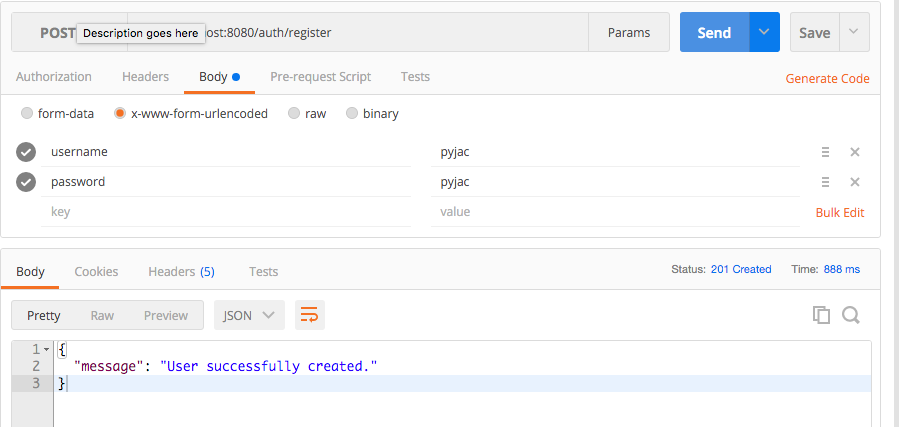
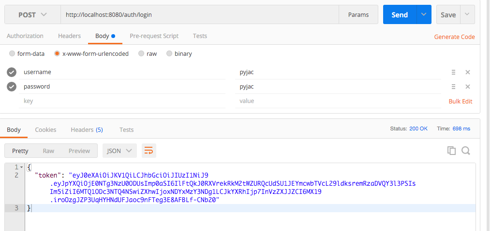
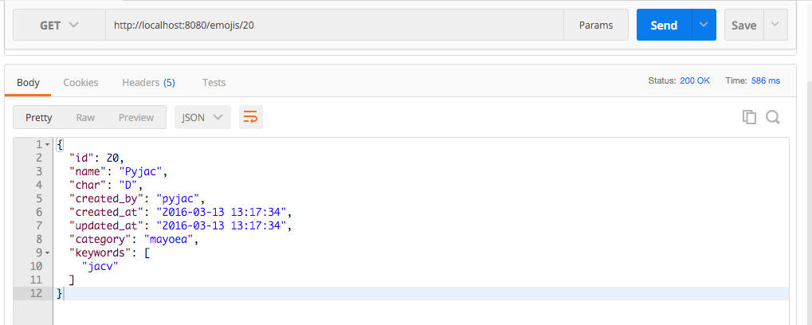
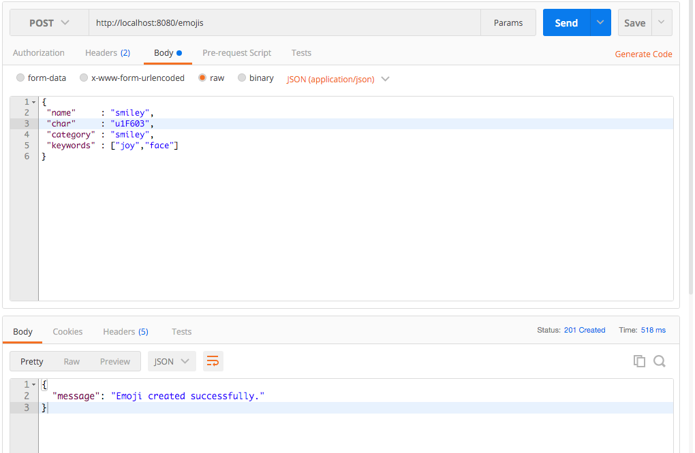

[](https://travis-ci.org/andela-joyebanji/NaijaEmoji) [](https://scrutinizer-ci.com/g/andela-joyebanji/NaijaEmoji/?branch=develop) [](https://coveralls.io/github/andela-joyebanji/NaijaEmoji?branch=develop)

### NaijaEmoji
[NaijaEmoji](http://naijaemoji.readthedocs.org/en/latest/) is a simple Restful API using Slim for NaijaEmoji Service.

##Usage
Clone this repository like so:

```
    git clone https://github.com/andela-joyebanji/NaijaEmoji.git
```

Change your directory to `NaijaEmoji` directory like so:

```
    cd NaijaEmoji
```

You need set your environment variables to define your database parameters or rename `.env.example` file in project to `.env` and change the below to your local configuration.

    DRIVER   = sqlite
    HOSTNAME = 127.0.0.1
    USERNAME = username
    PASSWORD = password
    DBNAME   = YourDatabase
    PORT     = port

All examples are shown in POSTMAN.

## Registration

To manage emojis, you'd need to register as a user. The `/auth/register` route handles user registration. 
 
You can register a user using `POSTMAN` like so:



Supply your preferred `username` and `password`.

## Login
To make use of routes that requires token authentication, you need to get a token. The `/auth/login` route handles token generation for users. 
You can get token like so:

Supply your registered `username` and `password`. You can now use the returned token to make other requests to restricted routes.

## Get all Emojis
To get all emojis, you send a `GET` request to `/emojis` route like so:


## Get an Emoji
To get an emoji, you send a `GET` request to `/emoji/{id of emoji}` route like so:


## Create Emoji
To create an emoji, you send a `POST` request, with your authentication token, to `/emojis` route with emoji's information like so:


## Delete Emoji
To delete an emoji, you send a `DELETE` request, with your authentication token, to `/emojis/{id of emoji}` route like so:


`Note: You can only delete an Emoji you created personally.`

## Update Emoji
To update an emoji, you send a `PUT` or `PATCH` request, with your authentication token, to `/emojis/{id of emoji}` route with the information you what to update like so:


## Security

If you discover any security related issues, please email [Oyebanji Jacob](oyebanji.jacob@andela.com) or create an issue.

## Credits

[Oyebanji Jacob](https://github.com/andela-joyebanji)

## License

### The MIT License (MIT)

Copyright (c) 2016 Oyebanji Jacob <oyebanji.jacob@andela.com>

> Permission is hereby granted, free of charge, to any person obtaining a copy
> of this software and associated documentation files (the "Software"), to deal
> in the Software without restriction, including without limitation the rights
> to use, copy, modify, merge, publish, distribute, sublicense, and/or sell
> copies of the Software, and to permit persons to whom the Software is
> furnished to do so, subject to the following conditions:
>
> The above copyright notice and this permission notice shall be included in
> all copies or substantial portions of the Software.
>
> THE SOFTWARE IS PROVIDED "AS IS", WITHOUT WARRANTY OF ANY KIND, EXPRESS OR
> IMPLIED, INCLUDING BUT NOT LIMITED TO THE WARRANTIES OF MERCHANTABILITY,
> FITNESS FOR A PARTICULAR PURPOSE AND NONINFRINGEMENT. IN NO EVENT SHALL THE
> AUTHORS OR COPYRIGHT HOLDERS BE LIABLE FOR ANY CLAIM, DAMAGES OR OTHER
> LIABILITY, WHETHER IN AN ACTION OF CONTRACT, TORT OR OTHERWISE, ARISING FROM,
> OUT OF OR IN CONNECTION WITH THE SOFTWARE OR THE USE OR OTHER DEALINGS IN
> THE SOFTWARE.

